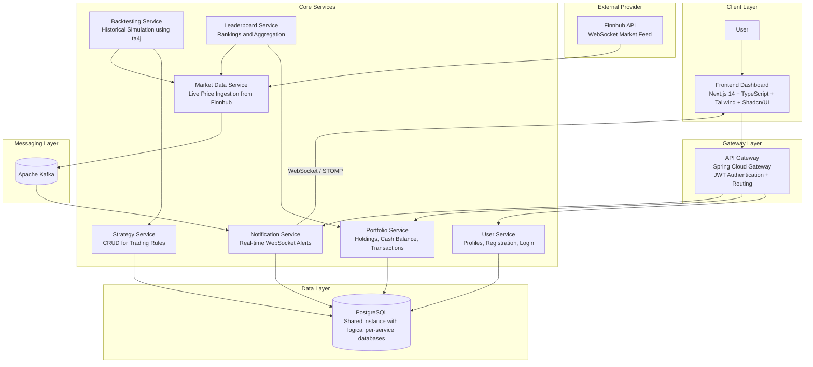

# TradeWise

TradeWise is a distributed algorithmic trading simulation platform that allows users to design trading strategies, backtest them against historical data, and observe real-time paper-trading performance without risking actual capital.

The platform is built using a **microservices architecture** that separates responsibilities such as market data ingestion, strategy management, portfolio tracking, and real-time notifications.

The goal of the project is to explore **distributed systems design, event-driven architectures, and real-time data streaming** in financial applications.

---

# High-Level Architecture

TradeWise consists of **7 domain microservices and an API Gateway**.  
The system uses an **event-driven data flow** where market prices are streamed into Kafka and downstream services react asynchronously.

Persistence is handled using a **shared PostgreSQL instance containing logically isolated databases for each service** that requires storage.



TradeWise uses an **event-driven pipeline** for real-time updates:

1. Market prices are streamed from **Finnhub**.
2. The **Market Data Service** publishes updates to **Kafka**.
3. The **Notification Service** consumes these events.
4. Updates are pushed to the frontend via **WebSockets**.

---

# Service Breakdown

| Service | Port | Description |
|-------|------|-------------|
| API Gateway | 8000 | Entry point for frontend requests. Handles routing and JWT authentication. |
| User Service | 8081 | Manages user registration, authentication, and profiles. |
| Portfolio Service | 8082 | Tracks holdings, balances, and simulated trading activity. |
| Strategy Service | 8083 | CRUD operations for trading strategies defined by users. |
| Market Data Service | 8084 | Streams live market prices from external APIs and publishes events to Kafka. |
| Backtesting Service | 8085 | Executes strategy simulations against historical data using ta4j. |
| Notification Service | 8086 | Consumes Kafka events and pushes real-time updates to the UI via WebSockets. |
| Leaderboard Service | 8087 | Aggregates portfolio performance and ranks users. |

---

# Tech Stack

## Backend Infrastructure

- **Java 17**
- **Spring Boot 3**
- **Spring Cloud Gateway**
- **Apache Kafka**
- **PostgreSQL**
- **Docker & Docker Compose**
- **ta4j** – Technical analysis library for strategy simulation

---

## Frontend

- **Next.js 14**
- **TypeScript**
- **Tailwind CSS**
- **Shadcn/UI**
- **Recharts**
- **Zustand**

---

# Key Features

### Microservice-Oriented Architecture
Each domain concern such as user management, strategy management, and portfolio tracking runs in an independent service.

### Event-Driven Data Flow
Market price updates are distributed via Kafka allowing services to react asynchronously.

### Real-Time Market Updates
WebSocket notifications push live price updates to the frontend without requiring page refresh.

### Strategy Simulation
Users can backtest trading strategies against historical data before using them in simulated trading.

### Secure Gateway Layer
All frontend requests pass through an API Gateway responsible for routing and authentication.

### Modern Dashboard UI
The frontend provides a responsive financial dashboard with live charts and trading insights.

---

# Running the Project

## Prerequisites

You will need:

- Docker Desktop
- Node.js 18+
- npm

---

# Start Backend Infrastructure

```bash
docker compose up --build
```

This command launches:

- PostgreSQL
- Kafka
- All backend microservices

The first startup may take **2–4 minutes** while containers build.

---

# Start Frontend

```bash
cd frontend/tradewise-client

npm install

npm run dev
```

---

# Access the Application

Open:

```
http://localhost:3000
```

---

# Development Notes

TradeWise was built primarily to explore:

- distributed system architecture
- event-driven messaging systems
- microservice communication patterns
- real-time financial data processing

The system intentionally separates **compute-heavy workloads (backtesting)** from **light request-response services (authentication, CRUD)** to mirror patterns used in scalable financial platforms.

---

# Future Improvements

Planned improvements include:

- Distributed tracing with **Zipkin or Jaeger**
- Machine learning service for **market sentiment analysis**
- **Kubernetes deployment** for container orchestration
- Integration with **broker APIs** for real trading execution
- Advanced **analytics dashboards**

---

# License

This project is intended for educational and experimental purposes.
