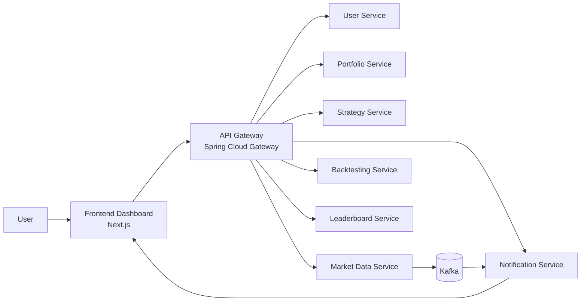

# TradeWise

TradeWise is a microservices-based algorithmic trading simulation platform where users can:

- Register and authenticate securely  
- Create portfolios and manage assets  
- Define rule-based trading strategies  
- Backtest strategies against historical market data  
- View leaderboard rankings  
- Receive realtime notifications and live price updates  

The platform is built to explore distributed systems design, event-driven communication, internal service contracts, realtime data pipelines, and full-stack fintech product architecture. :contentReference[oaicite:0]{index=0}

---

## Overview

TradeWise is designed as a distributed system with an API Gateway in front of multiple domain-specific services.

### Core Design Principles

- Synchronous request/response → CRUD, auth, backtesting  
- Asynchronous Kafka messaging → realtime updates  
- WebSocket/STOMP → frontend live updates  
- PostgreSQL (isolated DBs per service)  
- Gateway-first architecture  

### Supported Flow

1. Register and login  
2. Create portfolio  
3. Add assets  
4. Create strategy  
5. Run backtest  
6. View leaderboard and realtime updates  

---

## Architecture Diagram

## Service Breakdown

| Service | Port | Responsibility |
|--------|------|----------------|
| API Gateway | 8000 | Routing, JWT validation |
| User Service | 8081 | Auth, user info |
| Portfolio Service | 8082 | Portfolio + assets |
| Strategy Service | 8083 | Strategy CRUD |
| Market Data Service | 8084 | Market data ingestion |
| Backtesting Service | 8085 | Strategy simulation |
| Notification Service | 8086 | Kafka + WebSocket |
| Leaderboard Service | 8087 | Rankings |

---

## Core Flows

### 1. Authentication
- User registers  
- User logs in → JWT issued  
- Gateway validates JWT  
- User identity forwarded downstream  

---

### 2. Portfolio Flow
- Create portfolio  
- Add assets (e.g., IBM)  
- Ownership enforced via user identity  

---

### 3. Strategy Flow
- Create rule-based strategy  
- Stored using internal DTO contracts  
- Used by backtesting engine  

---

### 4. Backtesting Flow
- Fetch strategy  
- Fetch historical data  
- Translate rules → ta4j  
- Run simulation  

**Output:**
- Total trades  
- Profit/Loss  
- Return %  
- Win rate  
- Max drawdown  

---

### 5. Realtime Flow
- Market data → Market Data Service  
- Published to Kafka  
- Notification Service consumes  
- Sent to frontend via WebSocket  

---

### 6. Leaderboard Flow
- Fetch portfolios  
- Fetch market prices  
- Calculate rankings  
- Cache results  

---

## Tech Stack

### Backend
- Java 17  
- Spring Boot 3  
- Spring Security  
- Spring Cloud Gateway  
- Apache Kafka  
- PostgreSQL  
- ta4j  
- WebSocket / STOMP  
- Docker  

### Frontend
- Next.js  
- TypeScript  
- Tailwind CSS  
- shadcn/ui  
- TanStack Query  
- Zustand  
- React Hook Form  
- Zod  

---

## Key Design Decisions

### Gateway-first security
Frontend only talks to gateway → avoids duplication of auth logic  

### Internal service contracts
Explicit DTOs between services (especially Strategy ↔ Backtesting)  

### Event-driven architecture
Kafka decouples ingestion from delivery  

### Database isolation
Each service has its own DB schema  

---

## Project Structure

backend/
api-gateway/
user-service/
portfolio-service/
strategy-service/
market-data-service/
backtesting-service/
notification-service/
leaderboard-service/

frontend/
tradewise-client/

docker-compose.yml
init.sql
start.sh
README.md

---

## Running the Project

### Prerequisites
- Docker Desktop  
- Node.js 18+  
- npm  

---

### Start Backend

docker compose down -v --remove-orphans
docker compose up --build -d
docker compose ps
Start Frontend
cd frontend/tradewise-client
npm install
npm run dev
Access
Frontend → http://localhost:3000
Gateway → http://localhost:8000
Startup Helper
./start.sh
Smoke Test Flow
Register
Login
/api/users/me
Create portfolio
Add asset
Create strategy
Run backtest
Check leaderboard
Verify realtime updates
Example User Journey
Register
Login (JWT issued)
Create portfolio
Add asset (IBM)
Create strategy
BUY: RSI < 30  
SELL: RSI > 70
Run backtest
View results
Configuration Notes
Gateway

All frontend requests must go through the gateway

WebSocket

Endpoint:

/ws

Subscriptions:

/user/queue/notifications
/topic/prices/{symbol}
Docker Networking

Services communicate via:

strategy-service:8083
market-data-service:8084
portfolio-service:8082
Current Status
Working
Dockerized backend
JWT authentication
Portfolio + assets
Strategy creation
Backtesting
Leaderboard
Kafka + notifications
Frontend (In Progress)
Dashboard UX
Strategy builder
Leaderboard UI
Realtime updates
Known Limitations
Simplified notification triggers
Leaderboard not real-time optimized
Basic backtesting metrics
No distributed tracing
No centralized logging
No production-grade secrets
Future Improvements
Real alert engine
Advanced analytics
Trade history + equity curves
Distributed tracing
Centralized logging
Kubernetes deployment
Broker API integration
Why This Project Matters

TradeWise demonstrates:

Microservices architecture
Event-driven systems (Kafka)
Realtime systems (WebSocket)
Distributed system design
Fintech workflow simulation
Development Notes

Major improvements made:

Fixed strategy/backtesting contract mismatch
Introduced internal APIs
Standardized Docker setup
Cleaned service boundaries
License

This project is for educational and portfolio purposes.
