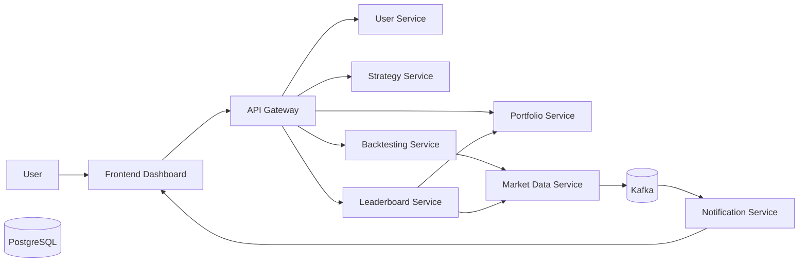

# TradeWise
**Distributed Algorithmic Trading Simulation Platform**

A production-style fintech system built using microservices, event-driven architecture, and real-time data pipelines.

---

## Why This Project Exists

TradeWise is not just a CRUD application.

It is a system design-focused platform that simulates how real-world trading systems handle:

- Distributed services
- Real-time market data
- Asynchronous messaging
- Strategy execution engines
- Portfolio analytics

---

## Demo

Watch full system demo: *(Add Loom/YouTube link here)*

Demo covers:
- Full system startup (Docker → all services)
- Authentication flow (JWT)
- Portfolio creation & asset management
- Strategy creation (RSI-based rules)
- Backtesting execution
- Leaderboard ranking
- Realtime updates (Kafka + WebSocket)

---

## Architecture

### Interactive Diagram (Best for Desktop)



### Static Diagram (Mobile Friendly)


---

## Service Breakdown

Each service is independently deployable, owns its data, and communicates via REST or Kafka.

| Service              | Port | Role            | Key Responsibility                              |
|----------------------|------|-----------------|-------------------------------------------------|
| API Gateway          | 8000 | Entry Layer     | JWT auth, routing, request filtering            |
| User Service         | 8081 | Identity        | Authentication, user info, dashboard aggregation|
| Portfolio Service    | 8082 | Core Domain     | Portfolio & asset lifecycle                     |
| Strategy Service     | 8083 | Core Domain     | Rule-based trading strategies                   |
| Market Data Service  | 8084 | Data Ingestion  | Live + historical market data                   |
| Backtesting Service  | 8085 | Compute         | Strategy simulation engine (ta4j)               |
| Notification Service | 8086 | Event Consumer  | Kafka → WebSocket delivery                      |
| Leaderboard Service  | 8087 | Aggregation     | Portfolio ranking + caching                     |

---

## Core System Flows

### 1. Authentication Flow
- User registers & logs in via API Gateway
- JWT issued and validated centrally
- Identity propagated via headers

### 2. Portfolio Flow
- Create portfolio
- Add assets (e.g., IBM)
- Ownership enforced per user

### 3. Strategy Flow
- Define BUY / SELL rule groups
- Indicators supported:
  - PRICE
  - SMA
  - EMA
  - RSI

### 4. Backtesting Flow
- Fetch strategy from Strategy Service
- Fetch historical data from Market Data Service
- Execute simulation using ta4j

Returns:
- Total trades
- Profit/loss
- Return %
- Win rate
- Max drawdown

### 5. Realtime Flow
- Finnhub → Market Data Service
- Published to Kafka
- Notification Service consumes events
- Delivered to frontend via WebSocket

### 6. Leaderboard Flow
- Fetch portfolios + assets
- Fetch current prices
- Compute returns
- Rank portfolios
- Cache results

---

## Tech Stack

### Backend
- Java 17
- Spring Boot 3
- Spring Security
- Spring Cloud Gateway
- Apache Kafka
- PostgreSQL
- ta4j
- WebSocket / STOMP
- Docker / Docker Compose

### Frontend
- Next.js
- TypeScript
- Tailwind CSS
- shadcn/ui
- TanStack Query
- Zustand
- React Hook Form + Zod
- SockJS + STOMP

---

## Running the Project

### Prerequisites
- Docker Desktop
- Node.js 18+
- npm

### Start Backend
```bash
docker compose up --build -d
```

### Start Frontend
```bash
cd frontend/tradewise-client
npm install
npm run dev
```

### Access
- Frontend: http://localhost:3000
- API Gateway: http://localhost:8000

---

## Smoke Test Flow

1. Register
2. Login
3. `/api/users/me`
4. Create portfolio
5. Add asset
6. Create strategy
7. Run backtest
8. Check leaderboard
9. Observe realtime updates

---

## What Makes This Project Strong

This project demonstrates:

- Microservices architecture
- Gateway-based authentication
- Event-driven systems (Kafka)
- Realtime streaming (WebSockets)
- Distributed system design
- Fintech-style workflows

---

## Challenges Solved

- Strategy to Backtesting contract mismatch
- Inter-service communication design
- Leaderboard consistency & caching
- Docker orchestration
- Real-time data synchronization

---

## Future Improvements

- Distributed tracing (Zipkin / Jaeger)
- Centralized logging
- Kubernetes deployment
- Broker API integration
- Advanced analytics dashboards

---

## Key Learnings

- Designing loosely coupled systems
- Handling async vs sync flows
- Building resilient distributed systems
- Thinking in terms of service boundaries

---

## Note

TradeWise is built as a system design-first project, not just a feature-driven app. It reflects how real-world fintech systems are structured and scaled.

---

*Prepared by Utkarsh Alshi*
