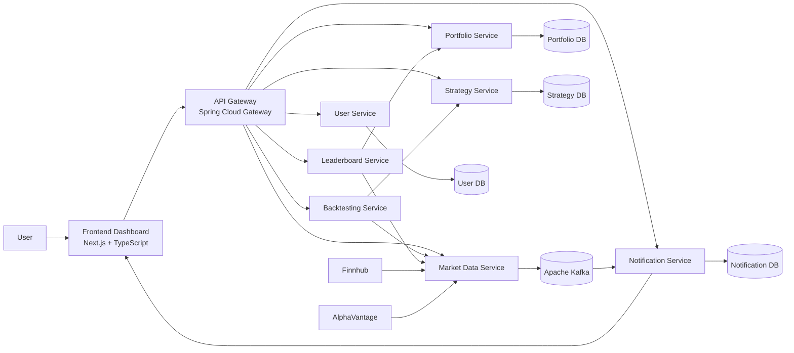

# TradeWise

TradeWise is a microservices-based algorithmic trading simulation platform that allows users to:

- register and authenticate securely
- create portfolios and manage assets
- define rule-based trading strategies
- backtest strategies against historical market data
- view leaderboard rankings
- receive realtime notifications and live price updates

The platform is built to explore distributed systems design, event-driven architectures, internal service contracts, realtime data pipelines, and full-stack fintech system design.

---

## Overview

TradeWise is designed as a distributed system with an API Gateway in front of multiple domain-specific services.

It combines:

- synchronous request/response communication for CRUD, authentication, and backtesting
- asynchronous Kafka-based messaging for realtime updates
- WebSocket/STOMP for frontend realtime delivery
- logically isolated PostgreSQL databases per service
- a unified frontend consuming everything through the gateway

The backend supports a complete end-to-end trading simulation flow:

1. Register and log in
2. Create a portfolio
3. Add assets
4. Create a strategy
5. Run a backtest
6. View leaderboard and realtime updates

---

## Architecture Diagram



---

## Service Breakdown

| Service                | Port | Responsibility |
|----------------------|------|----------------|
| API Gateway          | 8000 | JWT validation, routing, CORS |
| User Service         | 8081 | Auth, user info, dashboard aggregation |
| Portfolio Service    | 8082 | Portfolio + asset management |
| Strategy Service     | 8083 | Strategy creation and storage |
| Market Data Service  | 8084 | Historical + realtime data ingestion |
| Backtesting Service  | 8085 | Strategy simulation (ta4j) |
| Notification Service | 8086 | Kafka consumer + WebSocket delivery |
| Leaderboard Service  | 8087 | Ranking aggregation |

---

## Core Flows

### 1. Authentication Flow
- User registers and logs in via gateway
- JWT is issued and validated at gateway
- Gateway forwards user identity downstream
- Services trust forwarded identity

---

### 2. Portfolio Flow
- Create portfolio
- Add assets (e.g., IBM)
- Ownership enforced via user identity

---

### 3. Strategy Flow
- Create rule-based strategies
- Stored using internal DTO contracts
- Designed for compatibility with backtesting engine

---

### 4. Backtesting Flow
- Fetch strategy from Strategy Service
- Fetch historical data from Market Data Service
- Translate rules into ta4j indicators
- Execute simulation

Returns:
- total trades
- profit/loss
- return %
- win rate
- max drawdown

---

### 5. Realtime Flow
- Market data from Finnhub → Market Data Service
- Published to Kafka
- Notification Service consumes events
- Delivered via WebSocket/STOMP to frontend

---

### 6. Leaderboard Flow
- Fetch portfolio + market data
- Compute rankings
- Cache results
- Expose via API

---

## Tech Stack

### Backend
- Java 17
- Spring Boot 3
- Spring Security
- Spring Cloud Gateway
- Apache Kafka
- PostgreSQL
- ta4j
- WebSocket / STOMP
- Docker / Docker Compose

### Frontend
- Next.js
- TypeScript
- Tailwind CSS
- shadcn/ui
- TanStack Query
- Zustand
- React Hook Form + Zod
- SockJS + STOMP

---

## Key Design Decisions

### Gateway-first security
All client traffic flows through the gateway. JWT validation is centralized.

---

### Internal service contracts
Explicit DTOs are used for service-to-service communication to avoid coupling.

---

### Event-driven architecture
Kafka decouples market data ingestion from notification delivery.

---

### Database isolation
Each service owns its data:

- tradewise_user_db
- tradewise_portfolio_db
- tradewise_strategy_db
- tradewise_notification_db

---

### Internal endpoints
Backend services expose internal APIs for trusted communication (not user-facing).

---

## Implemented Features

### Authentication
- Register
- Login (JWT)
- Authenticated user fetch

### Portfolio
- Create portfolio
- Add/remove assets
- List assets

### Strategy
- BUY/SELL rule groups
- Indicators:
  - PRICE
  - SMA
  - EMA
  - RSI

### Backtesting
- Historical simulation
- ta4j integration
- Performance metrics

### Leaderboard
- Portfolio ranking
- Aggregation service

### Realtime
- Kafka-based updates
- WebSocket subscriptions

---

## Project Structure

```
backend/
  api-gateway/
  user-service/
  portfolio-service/
  strategy-service/
  market-data-service/
  backtesting-service/
  notification-service/
  leaderboard-service/

frontend/
  tradewise-client/

docker-compose.yml
init.sql
start.sh
README.md
```

---

## Running the Project

### Prerequisites
- Docker Desktop
- Node.js 18+
- npm

---

### Start Backend

```bash
docker compose down -v --remove-orphans
docker compose up --build -d
docker compose ps
```

---

### Start Frontend

```bash
cd frontend/tradewise-client
npm install
npm run dev
```

---

### Access

- Frontend → http://localhost:3000  
- Gateway → http://localhost:8000  

---

### Startup Helper

```bash
./start.sh
```

---

## Smoke Test Flow

1. Register
2. Login
3. `/api/users/me`
4. Create portfolio
5. Add asset
6. Create strategy
7. Run backtest
8. Check leaderboard
9. Verify realtime updates

---

## Example User Journey

1. Register  
2. Login (JWT issued)  
3. Create portfolio  
4. Add asset (IBM)  
5. Create strategy:  
   - BUY: RSI < 30  
   - SELL: RSI > 70  
6. Run backtest  
7. View results  

---

## Configuration Notes

### Gateway
All frontend requests must go through the gateway.

---

### WebSocket

Endpoint:
```
/ws
```

Subscriptions:
```
/user/queue/notifications
/topic/prices/{symbol}
```

---

### Docker Networking

Services communicate using:

```
strategy-service:8083
market-data-service:8084
portfolio-service:8082
```

---

## Current Status

### Working
- Dockerized backend
- JWT authentication
- Portfolio + assets
- Strategy creation
- Backtesting
- Leaderboard structure
- Kafka + notifications

### Frontend (In Progress)
- Dashboard UX
- Strategy builder
- Leaderboard UI
- Realtime updates

---

## Known Limitations

- Simplified notification triggers
- Leaderboard not optimized for high-frequency updates
- Basic backtesting metrics
- No distributed tracing
- No centralized logging
- No production-grade secret management

---

## Future Improvements

- Real trading signals (not simulated)
- Advanced analytics dashboard
- Trade history + equity curves
- Distributed tracing
- Centralized logging
- Contract testing
- Kubernetes deployment
- Broker API integration

---

## Why this project matters

TradeWise demonstrates:

- microservices architecture
- gateway-based authentication
- event-driven systems (Kafka)
- realtime streaming (WebSockets)
- distributed system design
- fintech-style product workflows

This makes it a strong backend + system design portfolio project.

---

## Development Notes

Key improvements made during development:

- fixed strategy/backtesting contract mismatch
- introduced internal service APIs
- improved Docker orchestration
- standardized service configs
- refined service boundaries

These changes transformed the system into a stable, production-like architecture.

---

## License

This project is intended for educational and portfolio purposes.
